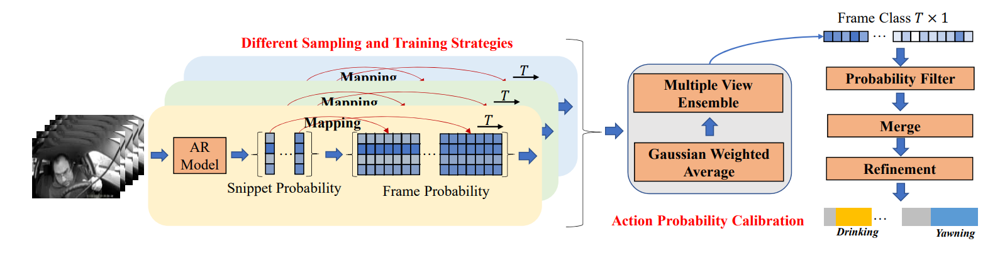
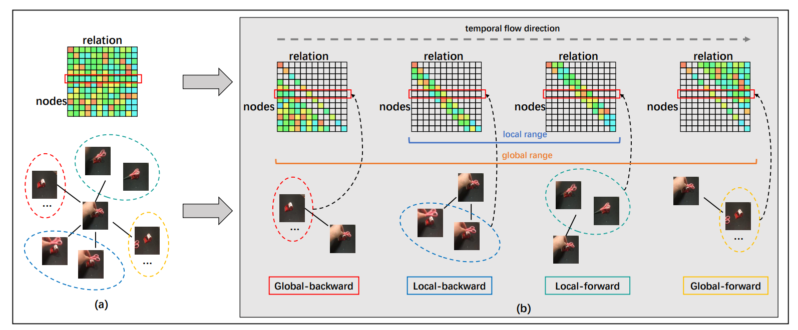

# Video Action Recognition Research of PRCI-Lab

### Action Probability Calibration for Efficient Naturalistic Driving Action Localizationn 
*Rongchang Li, Cong Wu, Linze Li, Zhongwei Shen, Tianyang Xu, Xiao-jun Wu, Xi Li, Jiwen Lu, Josef Kittler*, **CVPRW**, 2023.  

#### [[Paper](https://openaccess.thecvf.com/content/CVPR2023W/AICity/papers/Li_Action_Probability_Calibration_for_Efficient_Naturalistic_Driving_Action_Localization_CVPRW_2023_paper.pdf)]   [[Code](https://github.com/RongchangLi/AICity2023_DrivingAction)]
---

### I Know How You Move: Explicit Motion Estimation for Human Action Recognition 
*Zhongwei Shen, Xiao-Jun Wu, Tianyang Xu*, **IEEE TMM**( Early Access ), 2023.  

#### [[Paper](https://ieeexplore.ieee.org/document/9907887)]   [[Code](https://github.com/AlbertZW/MOTion-Estimator-MOTE-)]
---

### Motion Complement and Temporal Multifocusing for Skeleton-based Action Recognition
*Cong Wu, Xiao-Jun Wu, Tianyang Xu, Zhongwei Shen, Josef Kittler*, **IEEE TCSVT**(Early Access), 2023.  

#### [[Paper](https://ieeexplore.ieee.org/abstract/document/10015806)]  [[Code](https://github.com/cong-wu/MCMT-Net)]
---

### Graph2Net: Perceptually-Enriched Graph Learning for Skeleton-Based Action Recognition
*Cong Wu, Xiao-Jun Wu, Josef Kittler*, **IEEE TCSVT**, 2022.  

#### [[Paper](https://ieeexplore.ieee.org/document/9446181)]  [[Code](https://github.com/cong-wu/Graph2Net)]
---

### FEXNet: Foreground Extraction Network for Human Action Recognition
*Zhongwei Shen, Xiao-Jun Wu, Tianyang Xu*, **IEEE TCSVT**, 2022.  

#### [[Paper](https://ieeexplore.ieee.org/abstract/document/9509412)]   [[Code](https://github.com/AlbertZW/FEXNet)]
---

### Video is graph: Structured graph module for video action recognition
*Rongchang Li, Xiao-Jun Wu, Tianyang Xu*, **arXiv**, 2021.  

#### [[Paper](https://arxiv.org/abs/2110.05904)]  [[Code]()]
---

