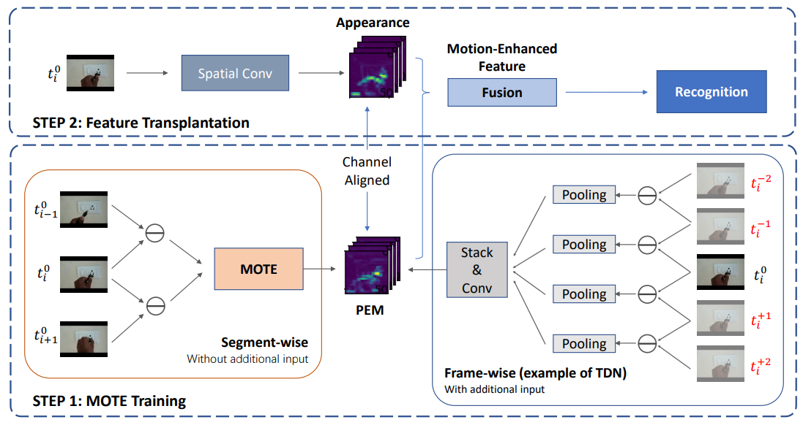
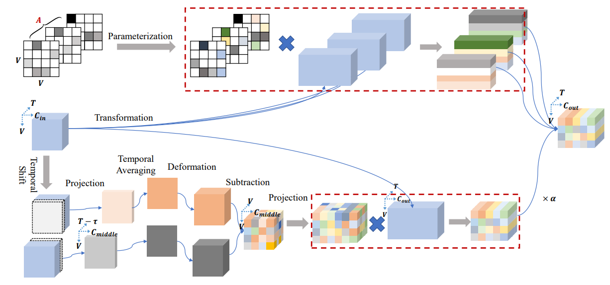
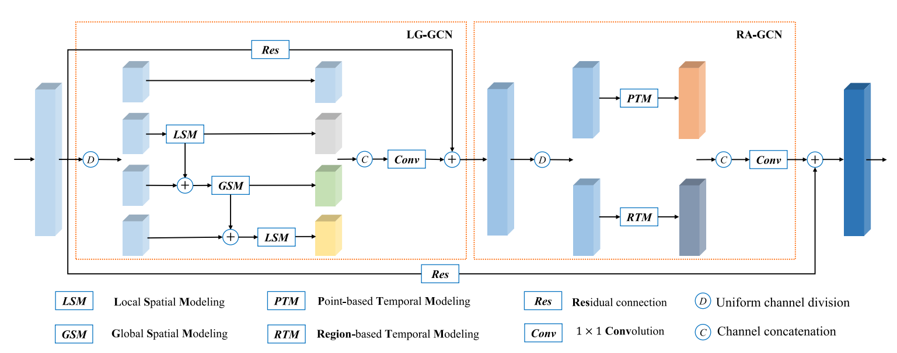
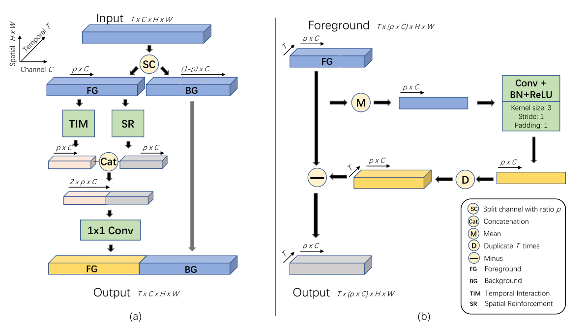

# Video Action Recognition Research of PRCI-Lab

### I Know How You Move: Explicit Motion Estimation for Human Action Recognition 
*Zhongwei Shen, Xiao-Jun Wu, Tianyang Xu*, **IEEE TMM**( Early Access ), 2023. 

#### [[Paper](https://ieeexplore.ieee.org/document/9907887)]   [[Code](https://github.com/AlbertZW/MOTion-Estimator-MOTE-)]
---

### Motion Complement and Temporal Multifocusing for Skeleton-based Action Recognition
*Cong Wu, Xiao-Jun Wu, Tianyang Xu, Zhongwei Shen, Josef Kittler*, **IEEE TCSVT**(Early Access), 2023.

#### [[Paper](https://ieeexplore.ieee.org/abstract/document/10015806)]  [[Code](https://github.com/cong-wu/MCMT-Net)]
---

### Graph2Net: Perceptually-Enriched Graph Learning for Skeleton-Based Action Recognition
*Cong Wu, Xiao-Jun Wu, Josef Kittler*, **IEEE TCSVT**, 2022.

#### [[Paper](https://ieeexplore.ieee.org/document/9446181)]  [[Code](https://github.com/cong-wu/Graph2Net)]
---

### FEXNet: Foreground Extraction Network for Human Action Recognition
*Zhongwei Shen, Xiao-Jun Wu, Tianyang Xu*, **IEEE TCSVT**, 2022.

#### [[Paper](https://ieeexplore.ieee.org/abstract/document/9509412)]   [[Code](https://github.com/AlbertZW/FEXNet)]
