# Visual Object Tracking Research of PRCI-Lab
### RGBD1K: A Large-scale Dataset and Benchmark for RGB-D Object Tracking   
*Xue-Feng Zhu, Tianyang Xu, Zhangyong Tang, Zucheng Wu, Haodong Liu, Xiao Yang, Xiao-Jun Wu, Josef Kittler,* **AAAI**, 2023. (**oral**) 
 **Dataset Details of RGBD1K**
* 1050 video sequences
* 1000 videos for training, containing 2,385,500 frames
* 50 videos for test, containing 117,900 frames
* 717,900 annotations
* 15 challenging attributes
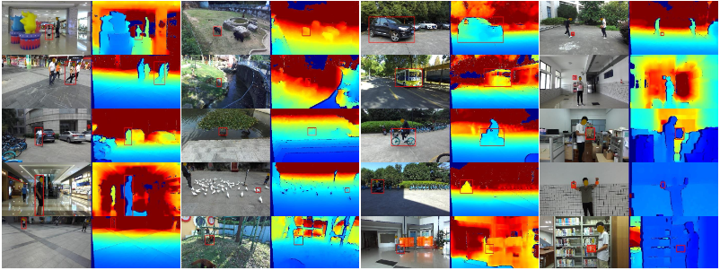
#### [[Paper](https://arxiv.org/abs/2208.09787)] \[[Code](https://github.com/xuefeng-zhu5/RGBD1K)]
------

### Toward Robust Visual Object Tracking With Independent Target-Agnostic Detection and Effective Siamese Cross-Task Interaction 
*Tianyang Xu, Zhenhua Feng, Xiao-Jun Wu, Josef Kittler,* **IEEE TIP**, 2023. 
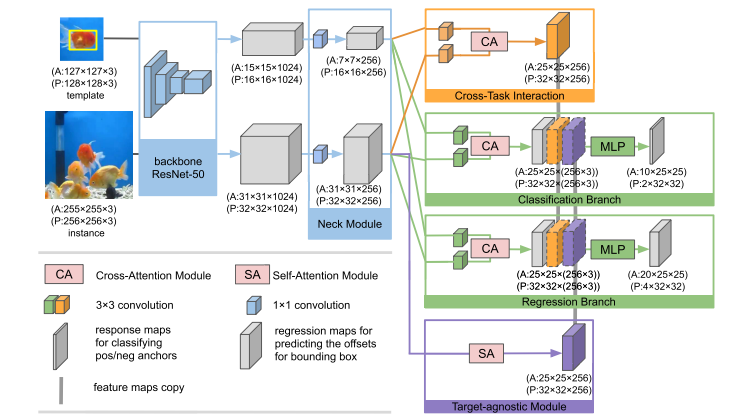
#### \[[Paper](https://ieeexplore.ieee.org/document/10053655)]\[[Code]()]
---------

### Distillation, Ensemble and Selection for building a Better and Faster Siamese based Tracker
*Shaochuan Zhao, Tianyang Xu, Xiao-Jun Wu, Josef Kittler,* **IEEE TCSVT**, 2022.
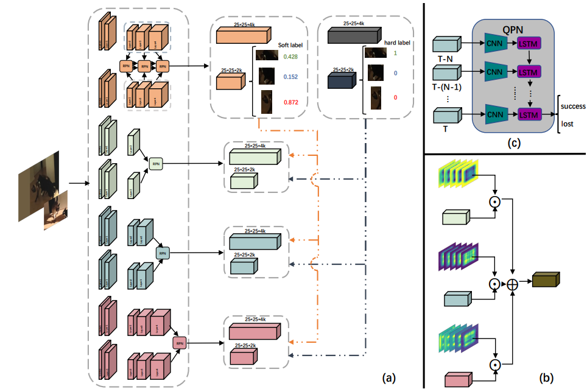
#### [[Paper](https://ieeexplore.ieee.org/document/9781254)]\[[Code]()]
----

###  Adaptive Channel Selection for Robust Visual Object Tracking with Discriminative Correlation Filters
*Tianyang Xu, Zhenhua Feng, Xiao-Jun Wu, Josef Kittler,* **IJCV**, 2021.
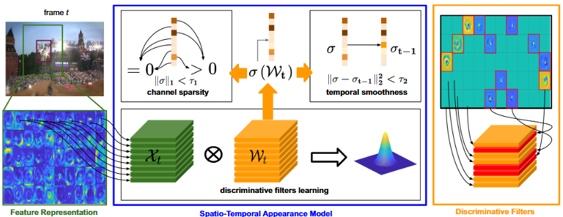
#### [[Paper](https://link.springer.com/content/pdf/10.1007/s11263-021-01435-1.pdf)] \[[Code](https://github.com/XU-TIANYANG/ACSDCF)]
----

### Adaptive feature fusion for visual object tracking
*Shaochuan Zhao, Tianyang Xu, Xiao-Jun Wu, Xue-Feng Zhu,* **Pattern Recognition**, 2021. 
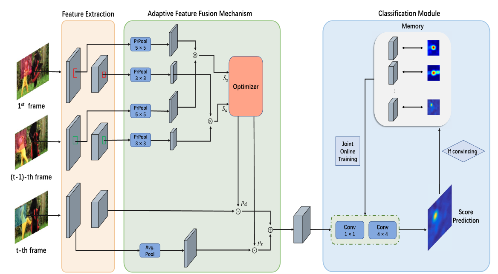
#### [[Paper](https://www.sciencedirect.com/science/article/abs/pii/S0031320320304829)]\[[Code]()]
----

### Robust Visual Object Tracking Via Adaptive Attribute-Aware Discriminative Correlation Filters
*Xue-Feng Zhu, Xiao-Jun Wu, Tianyang Xu, Zhen-Hua Feng, Josef Kittler,* **IEEE TMM**, 2021.
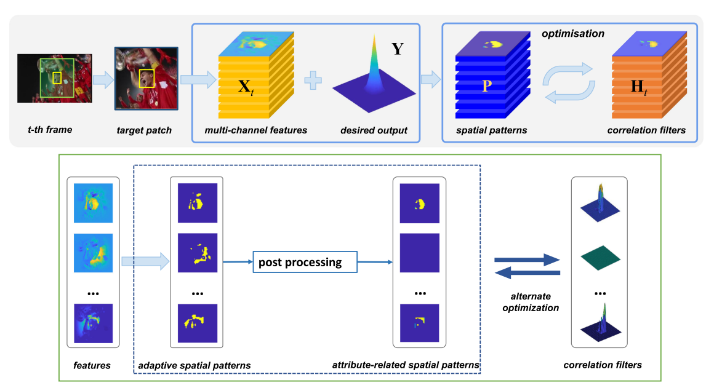
#### [[Paper](https://ieeexplore.ieee.org/document/9318537)] \[[Code](https://github.com/xuefeng-zhu5/A3DCF)]
-----

### An accelerated correlation filter tracker
*Tianyang Xu, Zhen-Hua Feng, Xiao-Jun Wu, Josef Kittler,* **Pattern Recognition**, 2020.
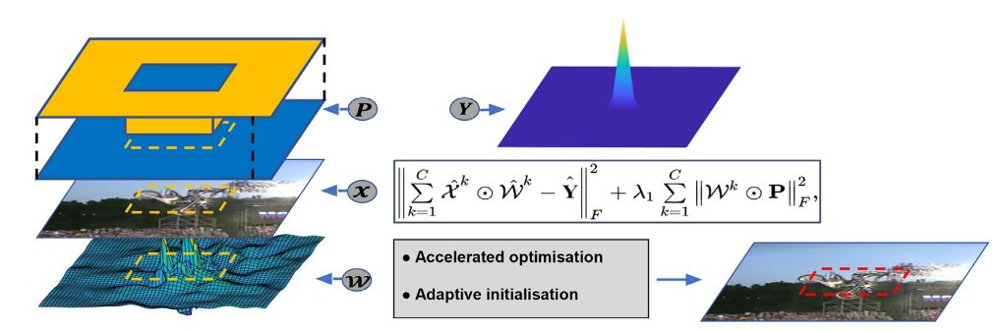
#### [[Paper](https://www.sciencedirect.com/science/article/pii/S0031320319304728)] \[[Code]()]
----

###  Complementary Discriminative Correlation Filters Based on Collaborative Representation for Visual Object Tracking
*Xue-Feng Zhu, Xiao-Jun Wu, Tianyang Xu, Zhen-Hua Feng, Josef Kittler,*  **IEEE TCSVT**, 2020.
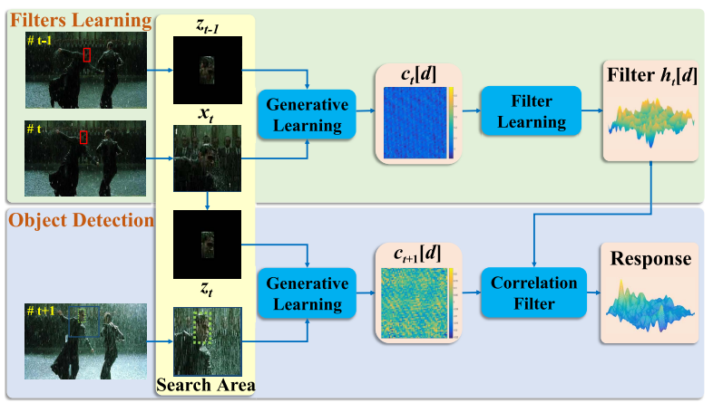
#### [[Paper](https://ieeexplore.ieee.org/document/9028150)] \[[Code]()]
---

### Learning Low-Rank and Sparse Discriminative Correlation Filters for Coarse-to-Fine Visual Object Tracking
*Tianyang Xu, Zhen-Hua Feng, Xiao-Jun Wu, Josef Kittler,* **IEEE TCSVT**, 2020.
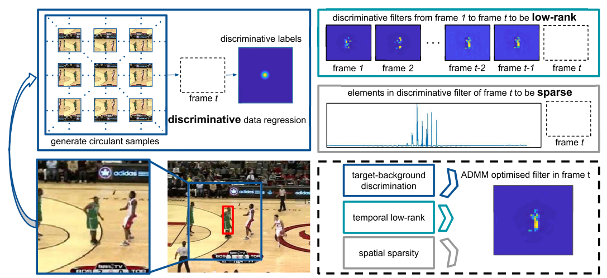
#### [[Paper](https://ieeexplore.ieee.org/document/8854808)] \[[Code](https://github.com/XU-TIANYANG/LSDCF)]
---

### Learning Adaptive Discriminative Correlation Filters via Temporal Consistency Preserving Spatial Feature Selection for Robust Visual Object Tracking
*Tianyang Xu, Zhen-Hua Feng, Xiao-Jun Wu, Josef Kittler,* **IEEE TIP**, 2019.
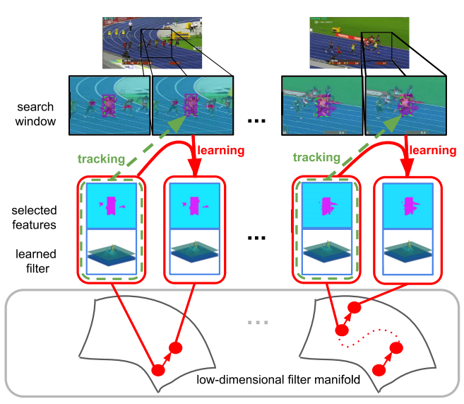
#### [[Paper](https://ieeexplore.ieee.org/document/8728173/)] \[[Code](https://github.com/XU-TIANYANG/LADCF)]
---

### Joint group feature selection and discriminative filter learning for robust visual object tracking
*Tianyang Xu, Zhen-Hua Feng, Xiao-Jun Wu, Josef Kittler,* **ICCV**, 2019.
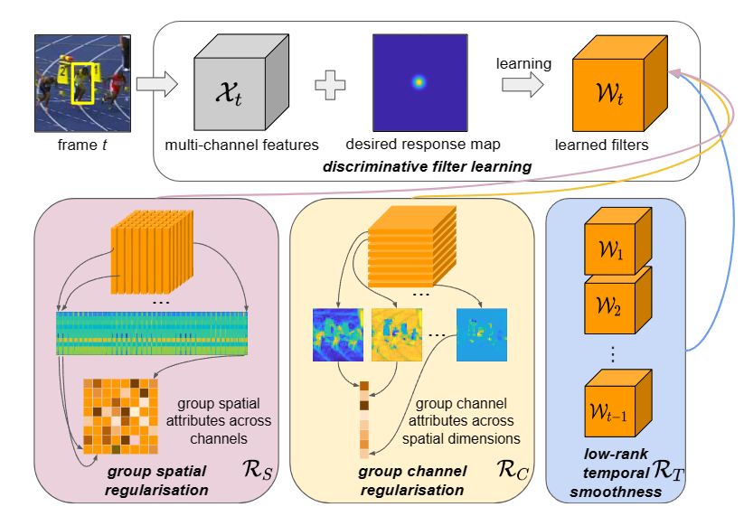
#### [[Paper](http://openaccess.thecvf.com/content_ICCV_2019/papers/Xu_Joint_Group_Feature_Selection_and_Discriminative_Filter_Learning_for_Robust_ICCV_2019_paper.pdf)] \[[Code](https://github.com/XU-TIANYANG/GFS-DCF)]
----

### Non-negative Subspace Representation Learning Scheme for Correlation Filter Based Tracking
*Tianyang Xu, Xiao-Jun Wu, Josef Kittler,* **ICPR**, 2018.
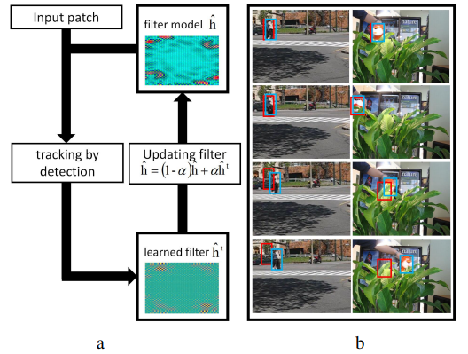
#### [[Paper](https://ieeexplore.ieee.org/document/8546146)] \[[Code]()]
